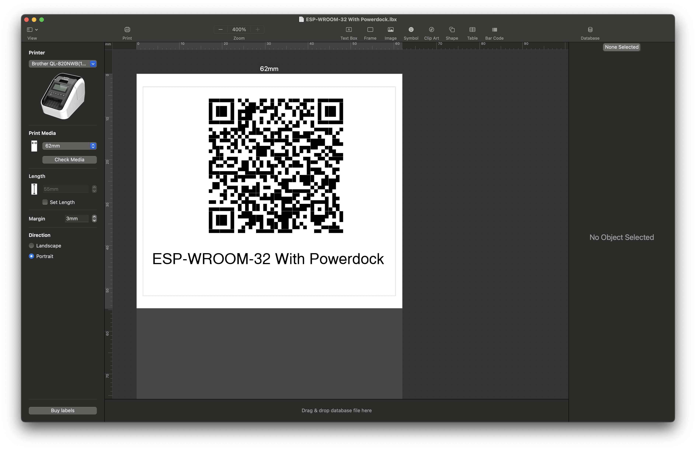

# Griminventory API

## Overview

**Griminventory API** is a Flask-based service designed to generate QR code labels for items stored in Notion.
The project includes support for Brother P-touch Editor by generating `.lbx` files. Each label contains the Notion
item title and a QR code linking to the item's page.

## Features

- Redirect to Notion page based on item UUID.
- Generate QR codes for Notion items.
- Generate `.lbx` files for Brother P-touch Editor (62mm landscape format).
- Labels include item titles and QR codes linking to the Notion page.

## Installation

## Usage

### Endpoints

| Endpoint                   | Method | Description                                                                               |
|----------------------------|--------|-------------------------------------------------------------------------------------------|
| `/v1/items/:item_uuid`     | GET    | Redirects to the corresponding Notion page using the provided `item_uuid`.                |
| `/v1/items/:item_uuid.png` | GET    | Returns a QR code PNG linking to the Notion page for the given `item_uuid`.               |
| `/v1/items/:item_uuid.lbx` | GET    | Returns a `.lbx` file for Brother P-touch Editor containing the Notion title and QR code. |

### Label example

---
Created with ❤️ using ☕️ and 🍍

If you enjoy using this project, consider donating! Your donations will go towards therapy sessions because
I'm an alcoholic and substance abuser and this is my cry for help. Cheers 🍻!
